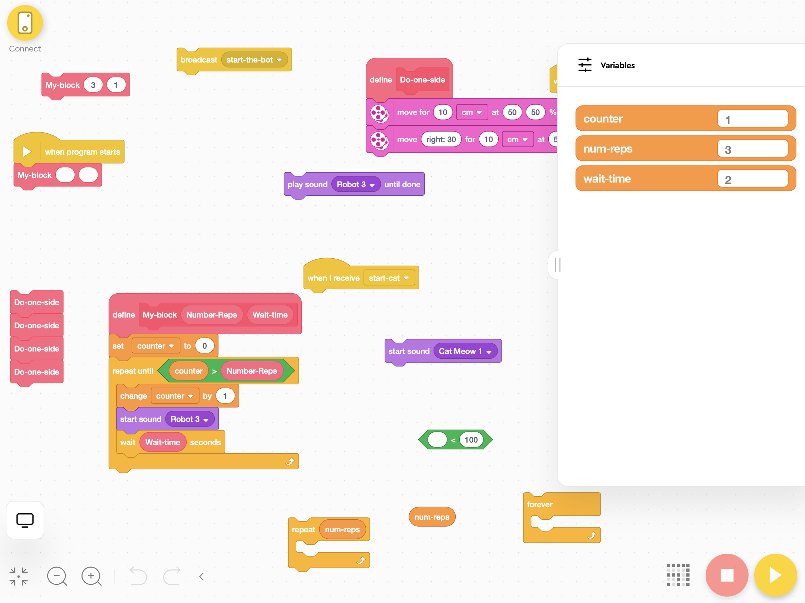

# Getting Started with Coding
Quick starter for Lego League

## Why learn Coding?
Whether you want to prepare for the future or just looking for a cool hobby, coding is a good skill to have in your tool kit. And remember, anyone can learn how to code!

## What is Coding?
Coding, sometimes called computer programming, is how we communicate with computers. Code tells a computer what actions to take, and writing code is like creating a set of instructions. By learning to write code, you can tell computers what to do or how to behave in a much faster way. You can use this skill to make websites and apps, process data, and do lots of other cool things.

## Introduction to Lego League Coding
- Spike Prime App Overview
- Code Options: Icon Blocks vs. Word Blocks vs. Python

## Program Constructs
- Variables
- Lists
- Conditions
- If then else
- Loops
- Repeat, Repeat Until
- Forever
- My Blocks (Custom Blocks)

## References
- Word Blocks: Read Prime Lessons  or Spike App > Help > Word Blocks
- SPIKE Prime Block Guide  
- LEGO SPIKE Prime: Exploring Scratch 
https://flltutorials.com/en/Worksheets.html 

